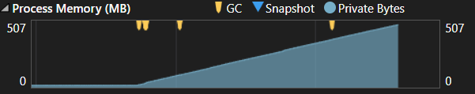
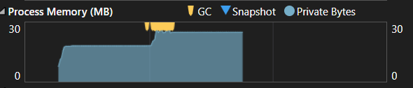

## Exploding Memory Code
 
1. **Continuous allocation increases memory usage**
   Creating a new `int[100000]` repeatedly causes memory consumption to continuously increase.
 
2. **Collections can retain objects**
   Adding every allocated array to List keeps references to those arrays, stoppping the Garbage Collector from reclaiming them.
 
3. **Garbage Collection cannot fix retained references**
   The Garbage Collector only collects objects that are no longer reachable.
 
4. **Large allocations affect the LOH**
   The `int[100000]` arrays are large allocations and can be placed on the Large Object Heap (LOH) and performence gets affected.
 
5. **Memory profiling helps identify the problem**
   Visual Studio Diagnostic Tools can be used to observe increasing memory usage and identify objects such as `System.Int32[]` that are consuming memory.
 

## Managing Memory
 
1. **Avoid unnecessary object retention**
   If allocated objects are no longer required, they should not be stored in long-lived collections.
 
2. **Allow objects to become unreachable**
   Once an object is no longer needed and there are no references to it, it becomes eligible for Garbage Collection.
 
3. **Minimize unnecessary allocations**
   Reducing repeated allocations, especially in performance-critical code, can improve memory usage and application performance.
 
4. **Profile before and after optimization**
   Comparing memory usage with Visual Studio Diagnostic Tools helps verify whether an optimization actually improved the application's memory behavior.
  